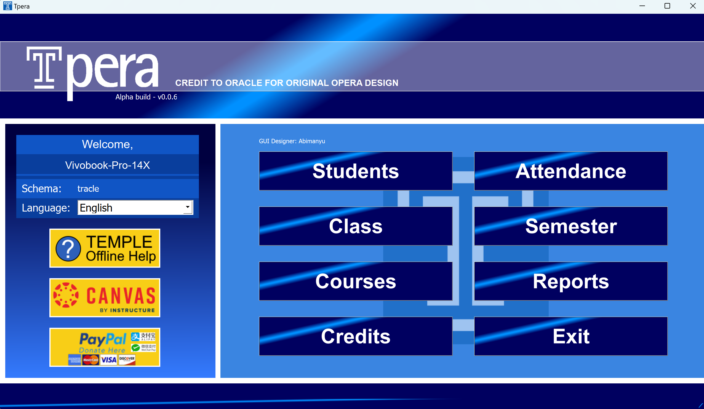
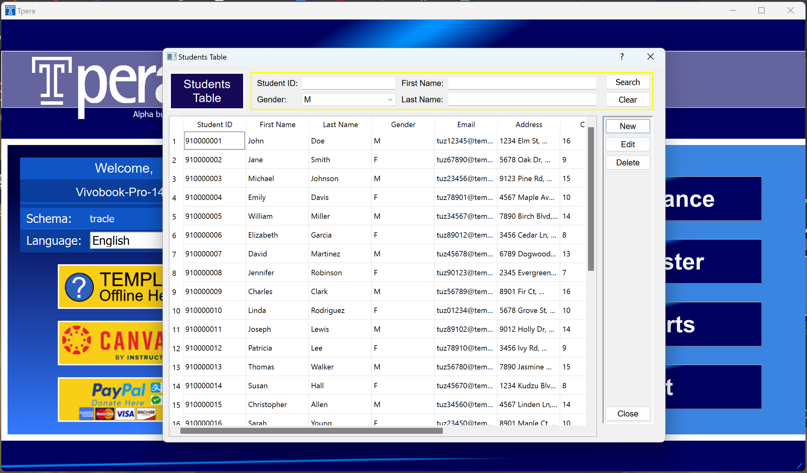
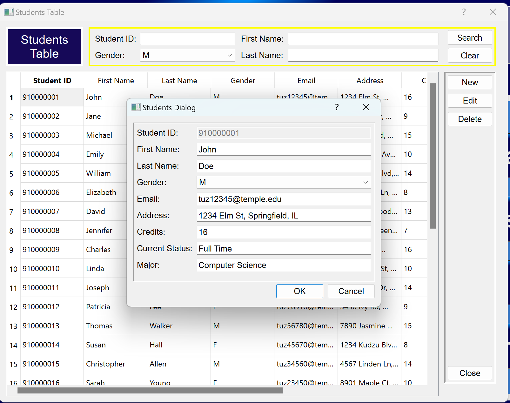
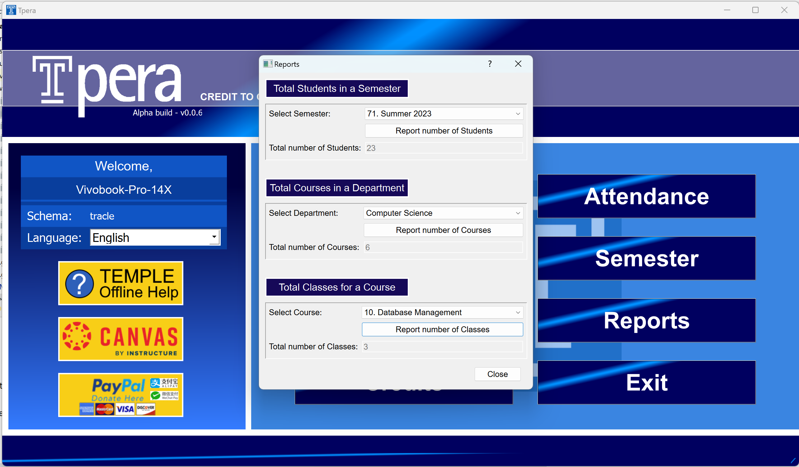
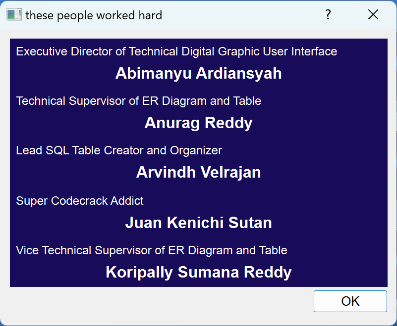

# Tracle-Database-Management-System
A Database Management System written in Python parodied after the real Oracle system. Part of Database Management Systems at Temple University Japan Summer 2023 with Professor Hani Karam.

## About The Project

Tracle Database Management System is a humorous and playful take on the world-renowned Oracle Database Management System. Designed as a light-hearted parody, Tracle aims to add a touch of fun to the world of database management, providing users with a unique and entertaining experience.

### The Origins of Tracle:
Tracle was born as a tongue-in-cheek response to the awe-inspiring reputation of Oracle, one of the most robust and powerful database systems in the industry. With a mischievous spirit, Tracle embraces the Oracle-like features and terminology but with a humorous twist. The project creators wanted to demonstrate that even the most serious and essential technologies can be appreciated with a sense of humor.

### Features and Functionality:

Divine Queries: Tracle offers divine querying capabilities that seemingly answer your questions before you even ask them. Watch in amazement as Tracle's queries respond to your whims and desires with an air of mystical omnipotence.

Nonsensical Clarity: While traditional database systems strive for crystal-clear error messages, Tracle chooses a path less traveled. Prepare to be amused by its witty, whimsical, and occasionally nonsensical error notifications that may leave you scratching your head while trying not to burst into laughter.

Levity in Transactions: Tracle takes a light-hearted approach to database transactions. Witness the "Rolling Thunder" feature, where commits and rollbacks are accompanied by epic sound effects, making even the most mundane data updates feel like an adventure.

Fortune Telling Indexes: Tracle's indexes seem to have a mind of their own, predicting your future data needs with a mystical touch. Who knew database indexing could be so unpredictable and fun?

The Oracle's Virtual Assistant (OVA): Meet the charming Oracle's Virtual Assistant (OVA) of Tracle. With an enchanting personality, OVA responds to your queries with oracle-like wisdom, peppered with jokes and puns that will leave you grinning.

### Disclaimer:
Tracle is purely a parody meant for entertainment purposes. It is not intended for use in any critical or professional database management scenarios. While it may bring smiles and laughter, it lacks the robustness and reliability of its namesake, Oracle, and should not be considered a replacement for serious database management needs.

## Gallery

## The team:

(<a href="#readme-top">back to top</a>)

